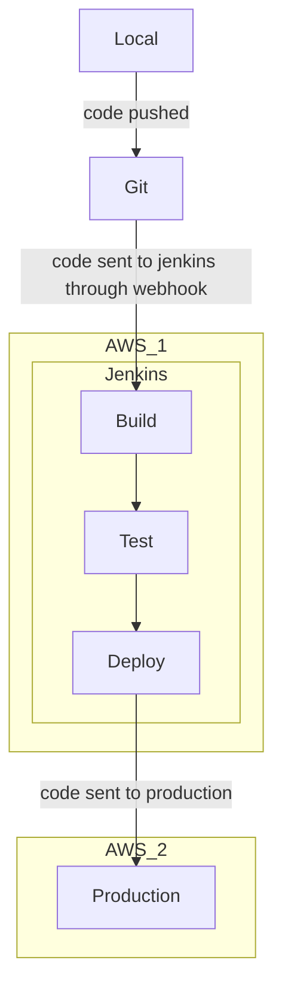

# Architecture outline

## Development
The development occurs through a very rudimentary [CI/CD pipeline](https://www.ibm.com/blog/ci-cd-pipeline/) deployed into an [AWS](https://en.wikipedia.org/wiki/Amazon_Web_Services) instance. Two AWS EC2 instances are used. One runs an instance of [Jenkins](https://www.jenkins.io/). Other runs the production server.

