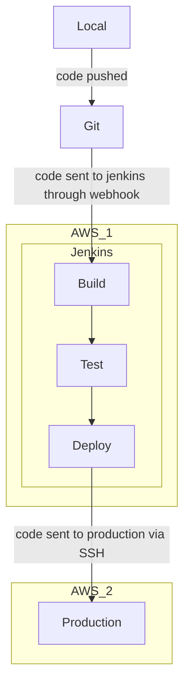

# Architecture outline

## Development
The development occurs through a very rudimentary [CI/CD pipeline](https://www.ibm.com/blog/ci-cd-pipeline/) deployed into an [AWS](https://en.wikipedia.org/wiki/Amazon_Web_Services) instance. Two AWS EC2 instances are used. One runs an instance of [Jenkins](https://www.jenkins.io/). Other runs the production server.

After pushing code Jenkins triggers the CI/CD pipeline and each respective phase is ran.

Build phase [containerizes](https://aws.amazon.com/what-is/containerization/) the application. Test phase runs small unit tests. Deploy phase sends the containerized application to production using [SSH](https://www.wikiwand.com/en/Secure_Shell). 

### Why do this for such a minor project?
It's fun

## Containerization
todo

## Application architecture
todo
